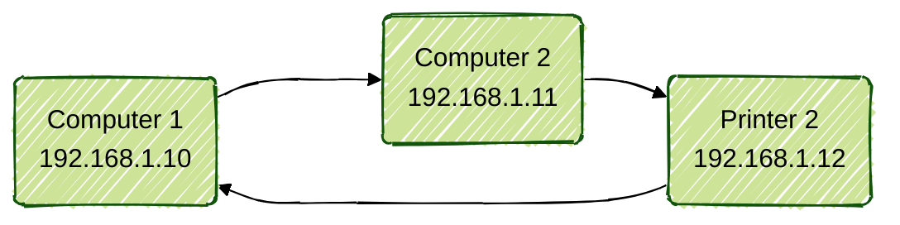
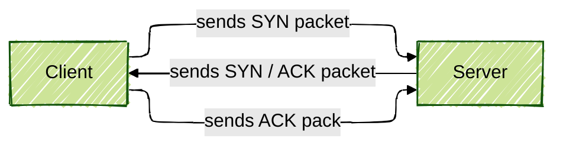

# What is TCP/IP ?
IP stands for Internet Protocol and TCP stands for Transfer Control Procol. Together, they form the TCP/IP, which are part of the Internet Protocol suite. 

The TCP/IP is the basis of Internet as a whole and provides end-to-end communication between various machines. For more information, visit [Wikipedia](https://en.wikipedia.org/wiki/Internet_protocol_suite). (I swear, it's really interresting. Go read it.)

# Sure, but what does TCP do ? 
TCP handles the connection and transmission of data packages. It provides an abstraction of the network connection. 

Overall, TCP is a protocol that ensure data is transmitted in a reliable way between applications running on devices connected to a network.

Breaking it down, the TCP performs the following actions:

- **Connection** Establishes connection between two hosts using a three way handshake. This methode allows the machines to ensure that the connection was properly established. (see [three-way handshake](#three-ways-handshake)).
- **Data segmentation**: The protocol then breaks down large chunk of data into smaller, more manageable segments to ensure efficient transmission. Should any packets be lost or corrupted, the protocol will detect it autonomously and resend the packets. 
- **Sequencing**: the packets are assigned a receiving order to ensure proper ordering on the client side. 
- **Acknowledgement & retransmission**: once the data is sent, the server awaits for the client to acknowledge it ; if it doesn't receive it in due time, it will resend the packets.
- **Flow control**: TCP is able to adjust the rate at which packets are transmitted based on network & receiver capacity.

# And what about IP ?
IP is the name of the communication protocol that enables routing datagrams between machines. Each machine has an IP adress ; together, they form an IP network. TCP uses that network to transfer packets between machines - think of the IP as the road and of TCP as the trucks driving the datagrams to its destination. 

For the purposes of Netpractice, the main thing that interrests us about IP are the adresses. 

The whole point of an IP adress is to identify your device and provide its location on the network.

The key points to remember are: 
- Your device is assigned an IP adress when it connects to the Internet
- When you request information (ie you visit a website), your device sends a request with your IP adress attached.
- Your router ([new character](https://en.wikipedia.org/wiki/Router_(computing))!) use the IP adresses and sends the data to the appropriate destination.
- The server you requested the information from sends the packets back to your IP adress and the information appears on your screen.

# Nice, how do connect machines to one another now ?
In order to connect machines to one another, we will use IPs and masks.

## IP - the technicalities
An IP adress typically looks like that:
> 192.168.1.1

Now, let's get a bit technical, shall we ? 

In IPv4 (for Internet Protocol version 4, as opposed to version 6), an IP adress is a 32-bits number wrote in dotted decimal format. Each field (also called octet) is an 8-bits decimal representation of a number comprised between 0 and 255.

For instance, for our previous example:
```
192.168.1.1

> 192 is the first octect
> 168 is the second
> 1 is the third
> 1 is the fourth
```

## Structure of an IP & subnet masking
Now would be a good time to inform you that IP adresses are divided in two parts :
- the **network part**, which identifies the network the device belongs to,
- and the **host part** that identifies that specific device within the network.

It would've been nice to have the two separated as statics fields; unfortunately it is not so. This is where the subnet masks get some actions. 

### What's that now ?
A mask is another 32-bits number that looks just like an IP adress (for instance, 255.255.255.0 is a mask). It is used, as mentionned previously, to determine which part of an IP adress relates to the network and which relates to the host. 

A mask is used converted to binary. Once converted,
- the ones in the subnet mask represent the network part of the adress
- the zeroes represent the host parts

```
> mask: 255.255.255.0
> converted in binary: 11111111.11111111.11111111.00000000

> IP: 192.168.1.1
> converted to binary: 11000000.10101000.00000001.00000001

comparing the two:
11111111.11111111.11111111.00000000
11000000.10101000.00000001.00000001

> We can see that the network part of the IP adress are the three first octects.
> The remaining octet is the host part.
```
> Don't worry, you won't have to do binary conversions by head. Some practice will be enough to associate values with their binary representation


### The network part
Lets keep working with out example IP. The network part of the adress is the **common** adress shared by all machines on a subnet. For instance, imagine a home network; all your machines connected to you local network will share the host part of your IP.


Notice how only the host part is changing - that is because all the devices are connected to the same network, and therefore share the same **network address**

### The host part
Now that that's clear, let's take a moment to focus on that host part of the IP adress. 

It determines the number of machines that can be connected to that specific network. In our previous example, our mask was `255.255.255.0` (also known as /24), which covers a pretty wide range of adresses - this means that we can connect up to 254 machines to that subnet, with adresses ranging from 1 to 254.

> Wait, I thought each octet could go up to 255 ? 

That's correct ! However, you should never use the smallest and greatest adresses (let's say, .0 and .255). Those are reserved adresses and your stuff won't work if you try that shit. Your range should always be the `range of your subnet - 2`. 

The formula to determine the size of your subnet is `255 - the host part of your IP adress`

> Examples are very useful !

```
Example
--
> Mask: 255.255.255.128
> Host part: 128
> Subnet range: 
	255 - 128 = 127

You can connect (127 - 2) machines to your subnetwork.

Your mask allows for 2 subnetworks in you network, with ranges :
	- .0 to .127,
	- .128 to .255

Since we always exclude min and max, the usable range of addresses for this mask would be:
	- .1 to .126
	- .129 to .254
```

### Subnets
Alright, so our .0 (/24) mask let us use 254 different adresses. Using such a large range of machines can lead to issues, and we prefer dividing large networks into smaller and more manageable ones for a variety of reasons, some of which are listed below:

- Smaller networks experience less congestions, 
- Data transfer between machines of the same subnet is more efficient, 
- Smaller networks are easier to monitor and to securise, allowing for tailoring specific security needs (ie, your accounting departement might need tighter security than other services).
- It helps optimize IP usage by creating smaller adresses pools, also facilitating organisation (ie, your accounting department will have adresses ranging from 0 to 64, while human ressources will go from 65 to 128...)
- Makes routing more efficient by reducing the size of routing tables.
- Makes the network more scalable by easily allowing new subnets to be added...


[Here is a cheat sheet of mask values and the adresses they cover](https://dnsmadeeasy.com/support/subnet)

## Routes, switchs and other fun stuff

### Switches
A switch is a device connecting multiples machines within a network, typically a LAN (Local Area Network). They allow devices to communicate with each other within a given network.

Using switches allow for an optimized data transmission process. The data is sent directly to the port requiring it, while also allowing simultaneous transmission and reception (also called **full-duplex mode**).

Switches connect machines **within** a network - the network adresses of the machines must remain identical.

### Routers 
Routers connect networks or subnetworks together. They functionnalities include:
- Managing data traffic between networks, 
- Allow multiple devices to use the same Internet connection, 
- Connect LANs to WAN (Wide Area Networks)

A router, as the name implies, handles routing. That is the process of selecting paths in a network along which data will travel. Indeed, the way from one machine to another is rarely simple - imagine you're emailing (yes, this is 2004. We are emailing people) your friend who lives in Japan. 

In order to reach your friend, the email has to go through your own router, then you ISP router, then a major router in your country, then a transatlantic cable router, then a router in Tokyo, etc. Every step of the way, your email is sent on to the next step, which is determined by the routing table. 

A routing contains the final destination of the packet the router is currently processing and the next step it should take to reach that final destination. 

For instance: 


## Three ways handshake
where 
- SYN = synchronise and 
- ACK = acknowledge



# More reading ? 
- [OSI Model](https://en.wikipedia.org/wiki/OSI_model)